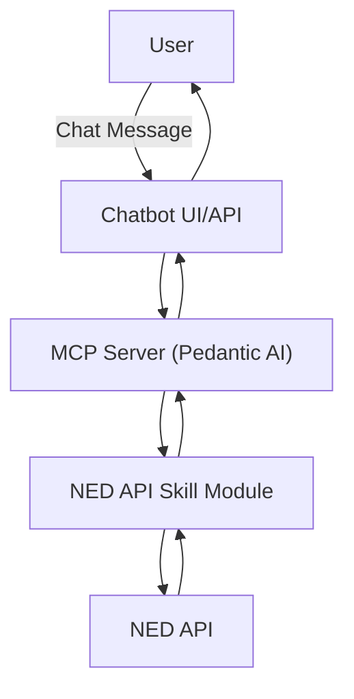

# NED API Chatbot

A chatbot interface for interacting with NED API data, leveraging the MCP server concept from Pedantic AI.

## Project Structure

- `src/` - Source code for the chatbot and server
- `data/` - Data files and resources
- `test/` - Unit and integration tests

## Features
- Conversational interface for NED API
- Modular MCP server architecture (Pedantic AI inspired)
- Extensible for new data sources and skills

## Getting Started
1. Clone the repository
2. Set up a Python virtual environment
3. Install dependencies from `requirements.txt`
4. Run the chatbot server

## Architecture

The project uses the MCP (Modular Command Processor) server pattern, where each skill or data source is a module. The chatbot interacts with the NED API through these modules, allowing for easy extension and maintenance.

## Flow Diagram

## Activities
1. To make NED API call and get data for 2025
2. To build a random forest model with train and test data
3. To make the model available as tool to the MCP
4. Receive chatbot query and provide response as predicted price

---

## License
MIT 